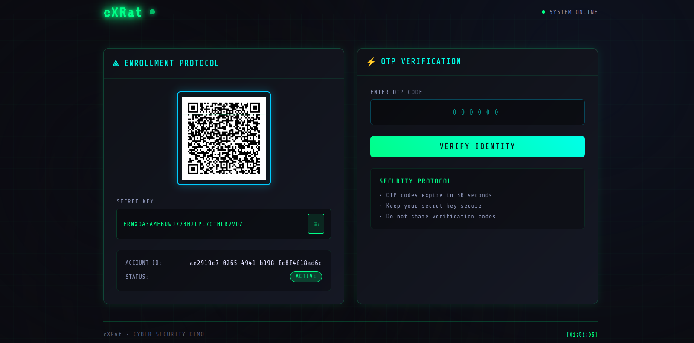
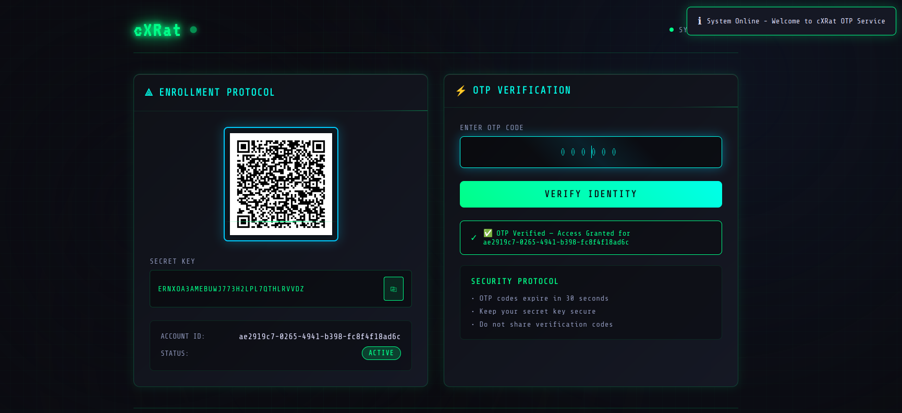

# 🔐 cXRat — Local 2FA (Two-Factor Authentication) Demo [Educational Project]

> ⚠️ **Educational Use Only** — This project is a local demo built for learning and teaching secure authentication workflows.  
> Do **not** use this configuration in production environments.

---

## 💡 Overview
**cXRat** is a lightweight, local **Two-Factor Authentication (2FA)** demo built using **Python and Flask**.  
It showcases how Time-based One-Time Passwords (**TOTP**) work end-to-end — from QR enrollment to token validation — while exploring security trade-offs such as clock drift, replay protection, and secret handling.

This project is designed for **educational and research purposes only**, making it ideal for cybersecurity students, developers, and trainers to understand how modern authentication works.

---

## ⚙️ Features
- 🧩 **QR Enrollment:** Generates provisioning URIs and QR codes for Google Authenticator / Authy.  
- ⏱️ **TOTP Verification:** Implements `pyotp` with ±30s drift tolerance.  
- 🔁 **Replay Protection:** Prevents OTP reuse within the same 30-second window.  
- 🧠 **Local Persistence:** Stores user data securely using SQLite (demo database).  
- 🧾 **Minimal Cyber UI:** Simple HTML/CSS/JS frontend for easy learning.  
- 🔒 **Security-Conscious Design:**  
  - `.env.template` for secrets  
  - Local certificate generation  
  - “EDUCATION ONLY” warnings  

---

## 🛠️ Tech Stack
- **Backend:** Python, Flask  
- **Libraries:** PyOTP, Pillow, QRCode  
- **Database:** SQLite (Demo)  
- **Frontend:** HTML, CSS, JavaScript  
- **Version Control:** Git & GitHub  

---

## 📸 Project Visuals

| Enrollment Page | OTP Verified | Demo Flow |
|:----------------:|:-------------:|:-----------:|
|  |  | 

---

## 🔒 Security Notice
This project is intended **for local educational use only**.  
Do **not** use it in production or with real credentials.

Missing production-grade safeguards include:
- 🔑 Secure key vault (e.g., AWS KMS or HashiCorp Vault)
- 🚫 Rate limiting & brute-force protection
- 🧱 Encrypted database storage
- 🌐 HTTPS with trusted certificates
- 📜 Audit logging & monitoring

---

## 🧩 Future Upgrades
- 🧭 **Admin Dashboard & Audit Logs**
- 🔢 **Backup Codes & SMS Fallback (Twilio Integration)**
- 🗝️ **Secure Key Vault (KMS / Vault)**
- 🗃️ **PostgreSQL Migration for multi-user scalability**
- 🐳 **Dockerization & CI/CD Workflow**
- 🧠 **Adaptive Risk-Based Authentication**

---

## 📈 Skills Demonstrated
- Secure Authentication Implementation  
- Web Security Fundamentals  
- Flask Development  
- Cryptography (TOTP, HMAC)  
- Research & Documentation  

---

---

## 🧠 Author
**Minosh Umayanga**  
Cybersecurity Researcher · Developer · Ethical Hacker  

> 🌐 [LinkedIn](https://www.linkedin.com/in/minoshumayanga) · 🐙 [GitHub](https://github.com/yourname)

---

## 🪪 License
This repository is shared under the **Educational License** for learning purposes.  
You may fork and experiment locally but **do not deploy it publicly or in production**.

---

